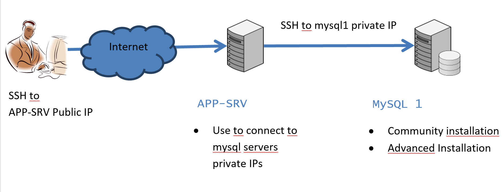

[Summary](./index.md)

[Previous](./test_connectivity.md)

# MySQL Architecture and Installation

## Introduction
These labs cover the yum installation, manual installation with tar file, understand client connection with musltiple instances on the same server and load of sample databases.

**References:**
- [https://dev.mysql.com/doc/mysql-yum-repo-quick-guide/en/](https://dev.mysql.com/doc/mysql-yum-repo-quick-guide/en/)
- [https://dev.mysql.com/doc/refman/8.0/en/validate-password.html](https://dev.mysql.com/doc/refman/8.0/en/validate-password.html)

**Servers to use:**


<details>
  <summary>Task 1 - Installation of MySQL Community</summary>

**Objective:** Installation of MySQL 8 (Community) on Oracle Linux 8. Because by default RedHat install MariaDB so, we update the repository to install the original MySQL.

**We are working on server:** mysql1

1.	Open an SSH client to app-srv

```shell
ssh -i id_rsa_app-srv opc@your_public_ip
```

2.	Connect to mysql1 from app-srv

```shell
ssh -i $HOME/sshkeys/id_rsa_mysql1 opc@mysql1
```

3.	**We work from now on server  mysql1.**
    Which MySQL packages are installed on your Linux?

```shell
sudo rpm -qa | grep mysql
```

4.	What happens when you try to install the mysql binaries with RedHat repositories? 
    Run this command but don’t confirm

```shell
sudo yum install mysql 
```

5.	As you have seen, above command try to install MariaDB sw. Each distribution has its own repositories and different choices for the packages to install.

6.	Oracle Linux 8 already have the official MySQL repository, but we want here to practice how to import it in a generic/education perspective. 
    First add the repository PGPkey

```shell
sudo rpm --import https://repo.mysql.com/RPM-GPG-KEY-mysql-2022 
```

7.	Now download the package from https://dev.mysql.com/downloads/ and install it

```shell
wget https://dev.mysql.com/get/mysql80-community-release-el8-1.noarch.rpm
```
```shell
sudo yum -y install mysql80-community-release-el8-1.noarch.rpm
```

8.	Update repository database with the new references
sudo yum repolist all

9.	Repeat the command above to install mysql-client (without using the mysql module id default repositories, to force the usage of MySQL ones) and note the different packages

```shell
sudo yum module disable mysql
sudo yum install mysql
```

10.	If only mysql packages are shown, confirm the installation.

11.	Install mysql-server

```shell
sudo yum install mysql-server
```

12.	Because MySQL is automatically installed you can use OS command for service management, for example to check if it’s already started

```shell
sudo systemctl status mysqld
```

13.	Start MySQL if not started

```shell
sudo systemctl start mysqld
```
```shell
sudo systemctl status mysqld
```

14.	Check the content of my.cnf, that is in default folder for linux OS and note some info (lines that stat with “\#” are just comments)

    1. Display the content of the file

    ```shell
    cat /etc/my.cnf 
    ```

    2.	Where is the database and the error log (mysqld.log) stored?
        Write down the answer.

    3.	check if there are error for the instance looking in the error log file

    ```shell
    sudo grep -i error /var/log/mysqld.log
    ```

 
15. Starting from MySQL 5.7 the default installation of MySQL Server generates a one-time password. You find it in error log notes above

```shell
sudo grep 'temporary' /var/log/mysqld.log
```

16.	Login to MySQL using password retrieved in previous step

```shell
mysql -uroot -p -h localhost
```

17.	Try to run a command and write down the error message.

    ERROR MESSAGE: _______________________________________________________________

```sql
status;
```

18.	Change root password

```sql
ALTER USER 'root'@'localhost' IDENTIFIED BY 'Welcome1!';
```


19.	Retry command above, now it works

```sql
status;
```

20.	Which databases are installed by default?

```sql
show databases;
```
<pre>
+--------------------+    
| Database           |  
+--------------------+  
| information_schema |  
| mysql              |  
| performance_schema |  
| sys                |  
+--------------------+  
4 rows in set (0.01 sec)
</pre>
    
21.	To see which version of MySQL you are using submit the command

```sql
show variables like "%version%";
```

22.	Check default users in standard installation

```sql
select user, host from mysql.user where user='root';
```

23.	Logout as ‘root’ and connect as admin

```sql
exit
```

</details>

<details><summary>Task 2 - Detailed Installation of MySQL on Linux</summary>

**Objective:** Installation of MySQL 8 (Community) on Oracle Linux 8. Because by default RedHat install MariaDB so, we update the repository to install the original MySQL.

**We are working on server:** mysql1

1.	If not already connected, connect to mysql1 server trhougth app-srv
    >
    ```shell
    ssh -i $HOME/sshkeys/id_rsa_mysql1 opc@mysql1
    ```

2.	On Oracle Linux8/RHEL8/Centos 8 is required to install ncurses-compat-libs to use the tar package (not for the rpms)
    >```shell
    sudo yum install -y ncurses-compat-libs
    ```

3.	Usually, to run mysql is used the user “mysql”, but because he’s already available we show here how create a new one.
    Create a new user/group for your MySQL service (mysqluser/mysqlgrp) and a add ‘mysqlgrp’ group to opc to help labs execution.
    ```shell
    sudo groupadd mysqlgrp
    ```
    ```shell
    sudo useradd -r -g mysqlgrp -s /bin/false mysqluser
    ```
    ```shell
    sudo usermod -a -G mysqlgrp opc
    ```

4.	Create new directory structure:
    ```shell
    sudo mkdir /mysql/ /mysql/etc /mysql/data
    ```
    ```shell
    sudo mkdir /mysql/log /mysql/temp /mysql/binlog
    ```

5.	To simplify the lab, add the mysql bin folder to the bash profile and customize the client prompt.
    Please insert these lines at the end of the file /home/opc/.bashrc

    >export PATH=$PATH:/mysql/mysql-latest/bin  
    export MYSQL_PS1="\\u - mysql>\\_"

    You can edit the file with the editor that you prefer, here some examples

    ```shell
    nano /home/opc/.bashrc
    ```
    ```shell
    vi /home/opc/.bashrc
    ```

6.	Close the ssh session and reopen it to activate the new privilege and settings for opc user

7.	Extract the tarball in your /mysql folder
    ```shell
    cd /mysql/
    ```
    ```shell
    ls -l /workshop/linux/mysql-commercial-8.0.*.tar.xz
    ```
    ```shell
    sudo tar xvf /workshop/linux/mysql-commercial-8.0.*.tar.xz
    ```

8.	Create a symbolic link to mysql binary installation
    ```shell
    sudo ln -s mysql-commercial-8.0.* mysql-latest
    ```

9.	Create a new configuration file my.cnf inside /mysql/etc
To help you we created one with some variables, please copy it
    ```shell
    sudo cp /workshop/support/my.cnf.mysql1 /mysql/etc/my.cnf
    ```

10.	Check the content of the configuration file to have a look inside.
Please note that, because the port 3306 is already in use by the community server previously installed , we use now port 3307.
    ```shell
    cat /mysql/etc/my.cnf
    ```

11.	For security reasons change ownership and permissions
    ```shell
    sudo chown -R mysqluser:mysqlgrp /mysql
    ```
    ```shell
    sudo chmod -R 750 /mysql
    ```

12. The following permission is for the Lab purpose so that opc account can make changes and copy files to overwrite the content
    ```shell
    sudo chmod -R 770 /mysql/etc
    ```

13.	Save the changes, log out and log in again from the ssh for the changes to take effect on the user profile.initialize your database
    ```shell
    sudo /mysql/mysql-latest/bin/mysqld --defaults-file=/mysql/etc/my.cnf --initialize --user=mysqluser
    ```

14.	Start your new mysql instance
    ```shell
    sudo /mysql/mysql-latest/bin/mysqld --defaults-file=/mysql/etc/my.cnf --user=mysqluser &
    ```

15.	Verify that process is running
    ```shell
    ps -ef | grep mysqld
    ```
    ```shell
    netstat -an | grep 3307
    ```

16.	Another way is searching the message “ready for connections” in error log as one of the last
    ```shell
    grep -i ready /mysql/log/err_log.log 
    ```

17.	Retrieve root password for first login
    ```shell
    grep -i 'temporary password' /mysql/log/err_log.log
    ```

18.	Before version 5.7 it was recommended to run the ' mysql_secure_installation ' script. From version 5.7 all these settings are “by default”, but the script can be used also to setup the validate_password plugin (used later). Execute now mysql_secure_installation
    ```shell
    mysql_secure_installation -h127.0.0.1 -P3307
    ```

    using these values
    - **root password:** retrieved from previous step
    - **new password:** Welcome1!
    - **setup VALIDATE PASSWORD component:** Y
    - **password validation policy:** 2
    - **Change the password for root:** N
    - **Remove anonymous users:** Y
    - **Disallow root login remotely:** N
    - **Remove test database:** Y
    - **Reload privilege tables now:** Y

19.	Login to you mysql-advanced installation and check the status.
    ```shell
    mysql -uroot -p -h 127.0.0.1 -P3307
    ```
    ```sql
    status
    ```

20.	Shutdown the service
    ```sql
    exit
    ```
    ```sql
    mysqladmin -uroot -h127.0.0.1 -p -P3307 shutdown
    ```

21.	Configure automatic startup and shutdown with system.
    Add a systemd service unit configuration file with details about the MySQL service. The file is named mysqld.service and is placed in /usr/lib/systemd/system. We created one for you (See addendum for the content)
    ```shell
    sudo cp /workshop/support/mysqld-advanced.service /usr/lib/systemd/system/
    ```
    ```shell
    sudo chmod 644 /usr/lib/systemd/system/mysqld-advanced.service
    ```
    ```shell
    sudo systemctl enable mysqld-advanced.service
    ```
 
22.	Test start, stop and restart
    ```shell
    sudo systemctl start mysqld-advanced
    ```
    ```shell
    sudo systemctl status mysqld-advanced
    ```
    ```shell
    sudo systemctl stop mysqld-advanced
    ```
    ```shell
    sudo systemctl status mysqld-advanced
    ```
    ```shell
    sudo systemctl restart mysqld-advanced
    ```
    ```shell
    sudo systemctl status mysqld-advanced
    ```

23.	Reconnect with mysql client
    ```shell
    mysql -uroot -p -h 127.0.0.1 -P3307
    ```

24.	Create a new administrative user called 'admin' with remote access and full privileges
    ```sql
    CREATE USER 'admin'@'%' IDENTIFIED BY 'Welcome1!';
    ```
    ```sql
    GRANT ALL PRIVILEGES ON *.* TO 'admin'@'%' WITH GRANT OPTION;
    ```

25.	In the configuration file was specified to load the commercial Thread Pool Plugin, check if it’s loaded and active. We use here the same command with different output (“;” vs “\G” as line termination)
    ```sql
    select * from information_schema.plugins where plugin_name like 'thread%';
    ```
    ```sql
    select * from information_schema.plugins where plugin_name like 'thread%'\G
    ```


</details>
<details><summary>Task 3 - Verify the new MySQL Installation on Linux</summary>

**Objective:** understand how MySQL connection works with multiple instances on the same server

**We are working on server:** mysql1

1.	If not already connected, connect to mysql1 server trhougth app-srv

```shell
ssh -i $HOME/sshkeys/id_rsa_mysql1 opc@mysql1
```

2.  Discussion about MySQL connections.
    Please note that now you have 2 instances on the same server: one on 3306 (community) and one on 3307 (commercial).
    MySQL (as default) interpret localhost as socket and not the 127.0.0.1 TCP address.
    This may end with strange behaviors and errors
    Here we practice connecting in various way and check what is working and what is not (note: port 3310 is intentionally wrong).

3.	Use the command in table below to test different connection strings and check the result.
    If the result is not clear to you, please ask an explanation to your instructor.
    Please note that “-p” lowercase refers to password, “-P” uppercase refer to the TCP port.

    Don’t be confused by the client version and check these lines, to understand “why” (not all are always available…)

    Current user:  
    Connection:  
    UNIX socket:  
    TCP port:  
    Server version:  

___
```shell
mysql -u root -p
```
```sql
status   
```
Port: 3306 or 3307? ______ SSL: Y/N ? ______ Connection: Socket/TCP? ______
___
```shell
mysql -u root -p -P3306
```
```sql
status   
```
Port: 3306 or 3307? ______ SSL: Y/N ? ______ Connection: Socket/TCP? ______
___
```shell
mysql -u root -p -P3307
```
```sql
status   
```
Port: 3306 or 3307? ______ SSL: Y/N ? ______ Connection: Socket/TCP? ______
___
```shell
mysql -uroot -p -h localhost -P3310
```
```sql
status   
```
Port: 3306 or 3307? ______ SSL: Y/N ? ______ Connection: Socket/TCP? ______
___
```shell
mysql -uadmin -p -h 127.0.0.1 -P3307
```
```sql
status   
```
Port: 3306 or 3307? ______ SSL: Y/N ? ______ Connection: Socket/TCP? ______
___
```shell
mysql -uadmin -p -h mysql1 -P3307
```
```sql
status

Note: we are using here the hostname 
```
Port: 3306 or 3307? ______ SSL: Y/N ? ______ Connection: Socket/TCP? ______
___
```shell
mysql -uroot -p -S /var/lib/mysql/mysql.sock
```
```sql
status   
```
Port: 3306 or 3307? ______ SSL: Y/N ? ______ Connection: Socket/TCP? ______
___
```shell
mysql -uroot -p -S /mysql/temp/mysql.sock
```
```sql
status   
```
Port: 3306 or 3307? ______ SSL: Y/N ? ______ Connection: Socket/TCP? ______
___

</details>

</details>
<details><summary>Task 3 - Import test databases</summary>

**Objective:**
- install test databases for labs (world and employees)
- have a look on useful statements

**We are working on server:** mysql1

1.	If not already connected, connect to mysql1 server trhougth app-srv

```shell
ssh -i $HOME/sshkeys/id_rsa_mysql1 opc@mysql1
```

2.	Now that we better understood how to connect, we can remove the community installation and refresh PATH cache with the bash command “hash”

```shell
sudo yum remove mysql mysql-server
```

```shell
hash -r
```

3.	Import the world database, that will be used later, from c:\workshop\databases\world  
    You can do it with mysql client

```shell
mysql -uadmin -p -P3307 -h mysql1 < /workshop/databases/world/world.sql
```

4.	Import the employees demo database that is in /workshop/databases folder. The load script is designed to be executed from the directory where it's located, so move there

```shell
cd /workshop/databases/employees
```

5. Now we can load the database
```sql
mysql -uadmin -p -P3307 -h mysql1 < ./employees.sql
```

5.	Now we can aslo have a look to some useful SQL Statements.
    So, we connect with the mysql client

```shell
mysql -uadmin -p -h mysql1 -P 3307
```

6. We can see the version of our instance

```sql
SHOW VARIABLES LIKE "%version%";
```

7. We can search which tables are or not in InnoDB Format (table format will be discussed in next module) 


```sql
SELECT table_name, engine FROM INFORMATION_SCHEMA.TABLES WHERE engine = 'InnoDB';
```

```sql
SELECT table_name, engine FROM INFORMATION_SCHEMA.TABLES WHERE engine <> 'InnoDB';
```

9. We can search which tables are in InnoDB Format and not in the system databases

```sql
SELECT table_name, engine FROM INFORMATION_SCHEMA.TABLES where engine = 'InnoDB' and table_schema not in ('mysql','information_schema', 'sys');
```

10. We can check the space used by engine

```sql
SELECT ENGINE, COUNT(*), SUM(DATA_LENGTH)/ 1024 / 1024 AS 'Data MB', SUM(INDEX_LENGTH)/1024 / 1024 AS 'Index MB' FROM information_schema.TABLEs group by engine;
```

11. We can check the space used by tables

```sql
SELECT table_schema AS 'Schema', SUM( data_length ) / 1024 / 1024 AS 'Data MB', SUM( index_length ) / 1024 / 1024 AS 'Index MB', SUM( data_length + index_length ) / 1024 / 1024 AS 'Sum' FROM information_schema.tables GROUP BY table_schema ;
```

12. We can check the actual connections

```sql
SHOW FULL PROCESSLIST; 
```

13. It's also possible to use a different terminator to show the result in horizontal (;) or vertical (\G) format.
    Try these commands.

```sql
SHOW GLOBAL VARIABLES\G
```

14. We can check various values for the overall status

```sql
SHOW GLOBAL STATUS\G 
```

```sql
SHOW ENGINE INNODB STATUS\G 
```

</details>

[Next](./mysql__database_design.md)

[Summary](./index.md)
